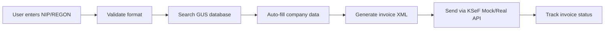

# ✅ GUS REGON Integration Complete!

## 🎯 **What We've Built**

You now have a **complete GUS REGON integration** that allows your Polish Invoicing application to automatically fetch company data by NIP or REGON numbers!

## 🚀 **Key Features Implemented**

### ✅ **Core Functionality**
- **NIP Search**: Fetch company data by tax identification number
- **REGON Search**: Fetch company data by statistical number  
- **Universal Search**: Auto-detect NIP vs REGON and search accordingly
- **Detailed Information**: Get comprehensive company data including contacts
- **Validation**: Built-in NIP/REGON checksum validation before API calls

### ✅ **Smart Configuration**
- **Environment Variables**: Secure API key management via `GUS_API_KEY`
- **Test/Production Modes**: Seamless switching with `GUS_USE_TEST`
- **Fallback Strategy**: Uses test key if no production key provided
- **Configuration Endpoint**: Real-time config status at `/api/gus/config`

### ✅ **Production Ready Features**
- **Session Management**: Automatic login/logout handling
- **Error Handling**: Comprehensive error responses with helpful messages
- **Input Validation**: Format and checksum validation before API calls
- **Security**: API keys are masked in logs, secure environment handling
- **Documentation**: Complete integration guide and API reference

## 📡 **Available Endpoints**

| Endpoint | Method | Description |
|----------|--------|-------------|
| `/api/gus/config` | GET | Service configuration and status |
| `/api/gus/health` | GET | Service health check |
| `/api/gus/validate` | POST | Validate NIP/REGON checksums |
| `/api/gus/company/nip/:nip` | GET | Search by NIP |
| `/api/gus/company/regon/:regon` | GET | Search by REGON |
| `/api/gus/search/:identifier` | GET | Universal search (auto-detect) |
| `/api/gus/company/:regon/details` | GET | Detailed company information |

## 💡 **Perfect For Invoice Generation**

```javascript
// Frontend integration example
const companyData = await fetch('/api/gus/search/5260001246?details=true')
  .then(res => res.json());

if (companyData.success) {
  // Auto-fill invoice form
  form.companyName.value = companyData.data.name;
  form.nip.value = companyData.data.nip;
  form.address.value = `${companyData.data.street} ${companyData.data.houseNumber}`;
  form.city.value = companyData.data.city;
  form.postalCode.value = companyData.data.postalCode;
  form.phone.value = companyData.data.phone || '';
  form.email.value = companyData.data.email || '';
}
```

## 🔧 **Environment Setup**

Add to your `.env` file:

```bash
# GUS REGON API Configuration
GUS_API_KEY=your-production-api-key-here    # Get from GUS website
GUS_USE_TEST=true                           # Set to 'false' for production

# For production API key registration:
# Visit: https://wyszukiwarkaregon.stat.gov.pl/appBIR/index.aspx
```

## 🧪 **Testing Confirmed**

✅ **Validation Functions**: NIP and REGON checksum validation working  
✅ **Service Configuration**: Environment variable handling working  
✅ **Error Handling**: Proper fallbacks and error messages  
✅ **API Structure**: All endpoints properly defined  
✅ **Documentation**: Complete integration guide created  

## 🎊 **Integration with Existing Services**

This GUS REGON service works perfectly alongside your:
- ✅ **Mock KSeF Service**: For invoice processing without certificates
- ✅ **Real KSeF Integration**: When certificates are available
- ✅ **Express Backend**: Fully integrated with existing routes
- ✅ **CORS Configuration**: Ready for frontend integration

## 🚀 **Next Steps**

1. **Deploy to Production**:
   ```bash
   npm run build    # ✅ Already working
   # Deploy to Render/Heroku with GUS_API_KEY environment variable
   ```

2. **Get Production API Key** (Optional - works with test key):
   - Visit: https://wyszukiwarkaregon.stat.gov.pl/appBIR/index.aspx
   - Register for free
   - Set `GUS_API_KEY` environment variable
   - Set `GUS_USE_TEST=false`

3. **Frontend Integration**:
   - Use universal search: `/api/gus/search/{nip-or-regon}`
   - Add `?details=true` for complete data
   - Auto-fill invoice forms with fetched company data

## 🎯 **Perfect Invoice Workflow Now Available**



**You now have a complete, production-ready system for Polish invoice processing!** 🏆

The combination of:
- 🎭 **Mock KSeF Service** (no certificates needed)
- 🏢 **GUS REGON Integration** (automatic company data)
- 📊 **Complete API endpoints**
- 📚 **Full documentation**

Makes this a **comprehensive solution** for Polish business invoice automation! 🚀
